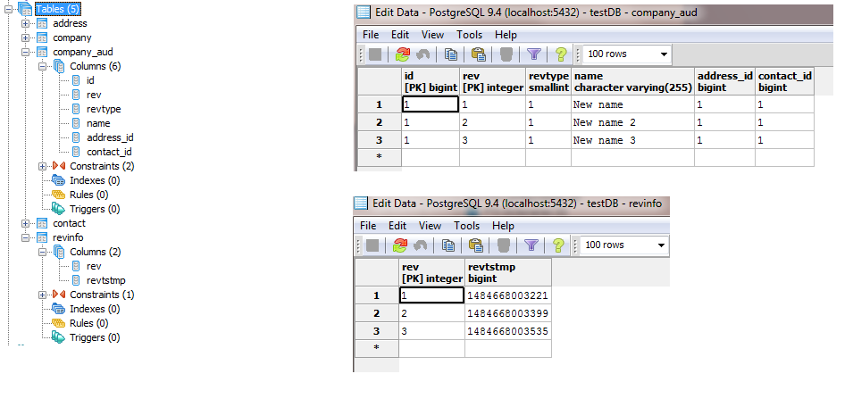
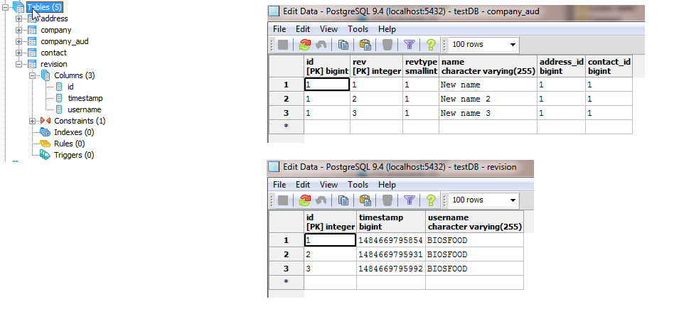

# Hibernate audit. How to log changes of entries in DB.

## Introduction
The article covers Hibernate extension Envers, which provides a graceful tool for managing revisions of a record in a database. 
The extension provides out of the box solution how to store revision of entries and iterate the entries.

I have a table Company, which contains few records. I would like to store changes, when columns of a record are updated, 
new values are assigned. From time to time, I'd like to take a look back in the time and see what values were assigned in columns. 
For example, take a look a grid below. The grid displays revisions three of an entry with ID = 1. Only name was changed few times, 
and something like I want fetch from database. Hibernate has out of the box solution to persists such changes. The solution is Hibernate Envers.

| date of change | id | address | contact | name   |
|----------------|----|---------|---------|--------|
| 2016-01-01     | 1  |  1      | 1       | Name 1 |
| 2016-03-15     | 1  |  1      | 1       | Name 2 |
| 2016-03-29     | 1  |  1      | 1       | Name 3 |


## Setting up a project
In this article I will use PostgreSQL server instead of in-memory server to demonstrate changes happen during a test run. 
So, test will be connected to PostgreSQL server, but I commented in-memory configuration, which you can uncomment for your tests. 

## Setting up the auditing
I have few entities, one of them is Company which represents Company table. I need to audit it - enable revisions storing. 
To do that I need to add to the class `Company` only one annotation `@org.hibernate.envers.Audited` and assign an attribute 
of the annotation `targetAuditMode` a value `RelationTargetAuditMode.NOT_AUDITED`. The attribute manages auditing of relations. 
In the class `Company.java` I have two relations fields `address` and `contact which I don't want to audit.

##### Company.java
```java
package info.biosfood.hibernate.audit.entities;

import org.hibernate.envers.Audited;
import org.hibernate.envers.RelationTargetAuditMode;
import javax.persistence.NamedQueries;
import javax.persistence.NamedQuery;
import javax.persistence.Entity;
import javax.persistence.FetchType;
import javax.persistence.OneToOne;
import javax.persistence.Column;
import javax.persistence.Id;

@NamedQueries(value = {
    @NamedQuery(
        name = Company.FETCH_ALL_COMPANIES,
        query = "SELECT c FROM Company c"
    )
})
@Entity
@Audited(targetAuditMode = RelationTargetAuditMode.NOT_AUDITED)
public class Company {
    
    public static final String FETCH_ALL_COMPANIES = "FETCH_ALL_COMPANIES";
    
    @Id
    private Long id;
    
    @OneToOne(fetch = FetchType.LAZY)
    private Address address;
    
    @OneToOne(fetch = FetchType.LAZY)
    private Contact contact;
    
    @Column
    private String name;
    
    public Long getId() {
        return id;
    }
    
    public void setId(Long id) {
        this.id = id;
    }
    
    public Address getAddress() {
        return address;
    }
    
    public void setAddress(Address address) {
        this.address = address;
    }
    
    public Contact getContact() {
        return contact;
    }
    
    public void setContact(Contact contact) {
        this.contact = contact;
    }
    
    public String getName() {
        return name;
    }
    
    public void setName(String name) {
        this.name = name;
    }

}
```

After running that code you can see changes in your database. Take a look on a left side.
Two new tables were created: company_aud and revinfo. The table `company_aud` contains modification which were applied 
during the test and the table `revinfo` contains information about revisions. The table `revinfo` contains revisions list 
for all audited entities in a project.



## Extending the auditing with extra information
What if I need to store extra information about the revision: a user name which made the modification. 
That is also simply extended. We will need to create two new classes. The modification will add us ability to add a user name, 
which calls a record change in a database.

##### CustomRevisionListener.java
```java
package info.biosfood.hibernate.audit.listeners;

import info.biosfood.hibernate.audit.entities.Revision;
import info.biosfood.hibernate.audit.services.UserService;
import org.hibernate.envers.RevisionListener;

public class CustomRevisionListener implements RevisionListener {

    UserService userService = new UserService();
    
    public CustomRevisionListener() {
    
    }
    
    @Override
    public void newRevision(Object o) {
        Revision revision = (Revision)o;
        
        revision.setUsername(getUserName());
    }
    
    protected String getUserName() {
        return userService.getCurrentUserName();
    }

}
```

##### Revision.java
```java
package info.biosfood.hibernate.audit.entities;

import info.biosfood.hibernate.audit.listeners.CredentialsRevisionListener;
import org.hibernate.envers.DefaultRevisionEntity;
import org.hibernate.envers.RevisionEntity;

import javax.persistence.Column;
import javax.persistence.Entity;

@Entity
@RevisionEntity(CustomRevisionListener.class)
public class Revision extends DefaultRevisionEntity {
    
    @Column
    private String username;
    
    public String getUsername() {
        return username;
    }
    
    public void setUsername(String username) {
        this.username = username;
    }

}
```

Before a test run I deleted all tables to start from scratch. Take a look a the database after the test run. 
Only one new table was created: `revision`. Before that table had a name `revinfo`. 
Now a new column was added - `username`. The column contains the user's name which has done the modification.



##Implementation of service
Lets implement a service which fetches revisions for modifications. The implementation is simple. 
`AuditReader` should be used to fetch revision for an entity. Each item of a result list is a three dimension array:
- first item is you entity (in my case it's an instance of `Company`);
- second item is an instance of `Revision`;
- third item is a type of change (instance of `RevisionType` - ADD, MOD, DEL).

##### CompanyRevisionService.java
```java
package info.biosfood.hibernate.audit.services;

import info.biosfood.hibernate.audit.beans.RevisionEntry;
import info.biosfood.hibernate.audit.entities.Company;
import info.biosfood.hibernate.audit.entities.Revision;
import org.hibernate.SessionFactory;
import org.hibernate.envers.AuditReader;
import org.hibernate.envers.AuditReaderFactory;
import org.hibernate.envers.query.AuditEntity;
import org.hibernate.envers.query.AuditQuery;
import org.springframework.beans.factory.annotation.Autowired;
import org.springframework.stereotype.Service;
import org.springframework.transaction.annotation.Transactional;

import java.util.ArrayList;
import java.util.List;

@Service
@Transactional
public class CompanyRevisionService {
    
    @Autowired
    private SessionFactory sessionFactory;
    
    public List<RevisionEntry<Company>> get(Long id) {
        AuditReader reader = AuditReaderFactory.get(sessionFactory.getCurrentSession());
        
        AuditQuery byId = reader.createQuery()
        .forRevisionsOfEntity(Company.class, false, true)
        .add(AuditEntity.id().eq(id));
        
        List<RevisionEntry<Company>> revisions = new ArrayList<>();
        
        for (Object row : byId.getResultList()) {
            Object[] array = (Object[]) row;
            revisions.add(new RevisionEntry<>((Company) array[0], (Revision) array[1]));
        }
        
        return revisions;
    }

}
```

I have a test which updates a `Company.name` field. After three updates I retrieve revision history from database and 
verify names with name I assigned before.

```java
public class CompanyServiceTest {

    private static final Logger LOG = Logger.getLogger(CompanyServiceTest.class);

    @Autowired
    CompanyService companyService;
    
    @Autowired
    CompanyRevisionService companyRevisionService;
    
    @Test
    public void testAudit() {
        LOG.debug("Fetching a company");
        Long companyId = 1L;
        
        Company company = companyService.get(companyId);
        
        assertEquals(companyId, company.getId());
        
        List<String> assignedBeforeNames = new ArrayList<>();
        
        assignedBeforeNames.add(assignNewNameAndReturn(company, "New name"));
        assignedBeforeNames.add(assignNewNameAndReturn(company, "New name 2"));
        assignedBeforeNames.add(assignNewNameAndReturn(company, "New name 3"));
        
        List<RevisionEntry<Company>> revisions = companyRevisionService.get(companyId);
        
        verifyNames(assignedBeforeNames, revisions);
    }
    
    protected void verifyNames(List<String> assignedBeforeNames, List<RevisionEntry<Company>> revisions) {
        verifyName(assignedBeforeNames.get(0), revisions.get(0)); // New name
        verifyName(assignedBeforeNames.get(1), revisions.get(1)); // New name 2
        verifyName(assignedBeforeNames.get(2), revisions.get(2)); // New name 3
    }
    
    protected void verifyName(String name, RevisionEntry<Company> revisionEntry) {
        LOG.debug("--- Verifying name ---");
        LOG.debug("Verified assigned name: " + name);
        LOG.debug("Company name in an object: " + revisionEntry.getItem().getName());
        LOG.debug("User name who made the change: " + revisionEntry.getRevision().getUsername());
        
        assertEquals(name, revisionEntry.getItem().getName());
    }
    
    protected String assignNewNameAndReturn(Company company, String newName) {
        company.setName(newName);
        companyService.update(company);
        
        return newName;
    }

}
```

##### Test output
```text
DEBUG [i.b.h.a.s.CompanyServiceTest] - --- Verifying name ---
DEBUG [i.b.h.a.s.CompanyServiceTest] - Verifying name: New name
DEBUG [i.b.h.a.s.CompanyServiceTest] - Company name in an object: New name
DEBUG [i.b.h.a.s.CompanyServiceTest] - User name who made the change: BIOSFOOD
DEBUG [i.b.h.a.s.CompanyServiceTest] - --- Verifying name ---
DEBUG [i.b.h.a.s.CompanyServiceTest] - Verifying name: New name 2
DEBUG [i.b.h.a.s.CompanyServiceTest] - Company name in an object: New name 2
DEBUG [i.b.h.a.s.CompanyServiceTest] - User name who made the change: BIOSFOOD
DEBUG [i.b.h.a.s.CompanyServiceTest] - --- Verifying name ---
DEBUG [i.b.h.a.s.CompanyServiceTest] - Verifying name: New name 3
DEBUG [i.b.h.a.s.CompanyServiceTest] - Company name in an object: New name 3
DEBUG [i.b.h.a.s.CompanyServiceTest] - User name who made the change: BIOSFOOD
```

## Conclusion
We have setup auditing for the entity `Company`. You should know that revisions for a particular entity are stored 
in a table with the same structure + system properties. Revisions history for all auditing objects are stored in one table. 
From the last example the table has a name `revision`.
